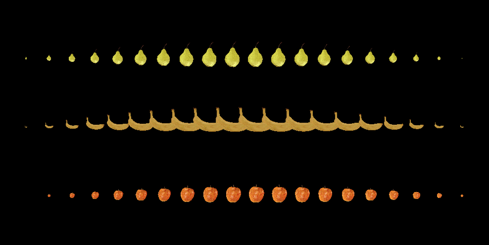

# Vulkan-Experiments

## Overview

This repo contains a simple implementation of a Vulkan renderer created following the excellent [Vulkan Tutorial](https://vulkan-tutorial.com/) website.

This implementation uses SDL instead of GLFW and follows a more C-like API design.

It's very much a WIP and is not ready for use other than as a learning tool.



## Dependencies

Currently tested on macOS.

Vulkan is installed on the system and is found with `find_package(Vulkan)` in the root `CMakeLists.txt` file. All other dependencies are found through the use of CMake `ExternalProject_Add` and `FetchContent`.

Vulkan setup instructions: https://vulkan.lunarg.com/doc/sdk/latest/mac/getting_started.html

```bash
VULKAN_SDK="<path/to>/vulkan-sdk/macOS"
export VULKAN_SDK
PATH=$PATH:$VULKAN_SDK/bin
export PATH
DYLD_LIBRARY_PATH=$DYLD_LIBRARY_PATH:$VULKAN_SDK/lib
export DYLD_LIBRARY_PATH
VK_LAYER_PATH=$VULKAN_SDK/share/vulkan/explicit_layer.d
export VK_LAYER_PATH
VK_ICD_FILENAMES=$VULKAN_SDK/share/vulkan/icd.d/MoltenVK_icd.json
export VK_ICD_FILENAMES
```
